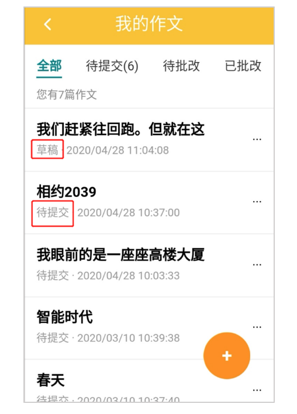
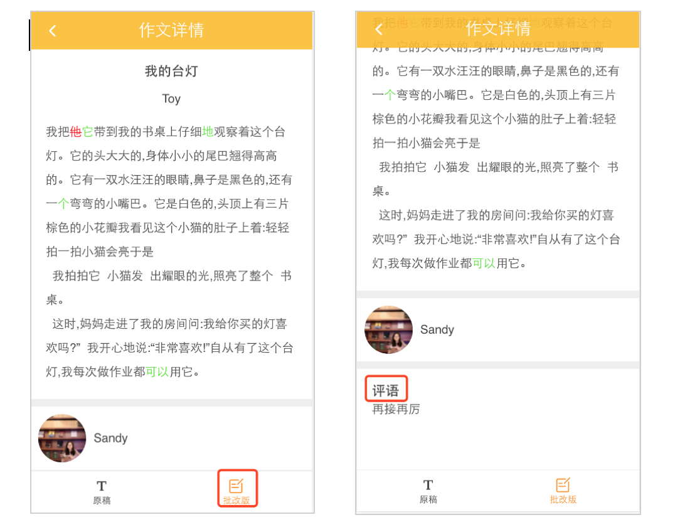

# 新手必读

## 如何查看课表
- 进入公众号或APP【个人中心】，点击【我的课表】，可看到当月有课的日期。

- 点击某个有课的日期，可查看当天具体的课程信息，包括：老师、课程、上课时间、地点等。  

## 如何获取课堂讲义
1. 进入公众号【个人中心】，点击【课堂讲义】  

2. 进入课堂讲义，最新更新的讲义在最前面。按下图提示分两步操作：  

3. 点击【下载】，根据页面提示在浏览器中打开页面执行讲义下载操作。
4. 或者你也可以点击【复制链接】操作后，[粘贴]到电脑微信，你就能获取所选讲义的下载链接，举例如下所示：
 ```
[3946]测试3 https://cris.mecourse.cn/files/2020021309175919.pdf
[3946]测试8 https://cris.mecourse.cn/files/2020021309175919.pdf
[3946]测试4 https://cris.mecourse.cn/files/2020021309175919.pdf
 ```
## 如何上传作文
- 进入公众号【个人中心】，点击【我的作文】，点击右下角【+】按钮添加作文（见下图）。

- 点击 【+】按钮后，系统会给出选择，【文本】和【图片】，家长根据自己的需求进行选择。  
选择【文本】，则在后续界面中手动输入作文标题和正文内容，输入完毕后，点击【保存】。  
选择【图片】，则在后续界面中添加作文照片。最多可上传3张图片，请按照作文的书写顺序上传图片，照片需要竖拍，单页拍照，并确保作文的完整性！！！（见下图）。  

- 选择【图片】模式上传，当图片上传好后，点击【识别成文字】按钮，此操作会将图片里的文字自动识别出来，形成文字版作文。文字版作文识别出来后，请家长对作文的题目和正文进行调整，并分好段落（这步很重要！！！），调整完成后，点击【保存】按钮（如果识别完文字后未点击保存按钮，作文也不会丢失，会以草稿形式保存在我的作文里），此时系统会提示创建作文成功，是否现在提交本篇作文给老师批改。可以选择【去提交】或【暂不提交】，选择【去提交】后，用户需选择对应的课次（当用户所选课次报名学员超过1名时，还需要选择此篇作文对应的学员），上传作文完成；**若选择【暂不提交】，则自动保存在我的作文里，显示为“待提交”状态，“待提交”的作文老师看不到！！！**  


## 如何查看作文是否提交成功
在【我的作文】里，可以根据作文状态来判断作文是否提交成功，作文状态一共有以下四种：草稿、待提交、待批改、已批改。（见下图）

1. 草稿：以图片形式上传作文，当完成“识别成文字”一步时，未点击“保存”按钮，则作文状态为“草稿”。
2. 待提交：作文创建成功后，选择【暂不提交】，则作文状态为“待提交”。请注意：“待提交”状态的作文，表示还未提交给老师，老师是无法查看和批改待提交的作文的！！！
3. 待批改：作文创建成功后，选择【去提交】，若提交成功，则作文状态为“待批改”。
4. 已批改：老师对作文进行批改后，作文状态显示为“已批改”。

## 如何查看老师的批改版及评语
在【我的作文】里，选中一篇状态为“已批改”的作文，点击进入【作文详情】，里面可以查看老师的批改版以及老师评语（见下图）。


## 如何查看课堂反馈（上课内容和课后作业）
- 进入公众号【个人中心】，点击【课堂反馈】，点击某个课程，即可查看该课程相关的”上课内容“和”课后作业“。


## 如何上传课后作业及查看老师回复
- 进入公众号【个人中心】，点击【课堂反馈】。点击某个课程进入详情页。
- 在课堂反馈详情页底部，点击【上传作业】，根据提示完成课后作业的提交，等待老师的回复。

- 收到微信或APP的【家庭作业通知】后，进入课堂反馈详情页面，可查看老师对学生作业的回复。
