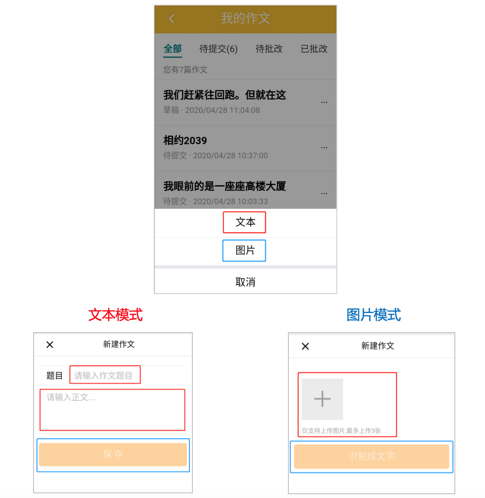
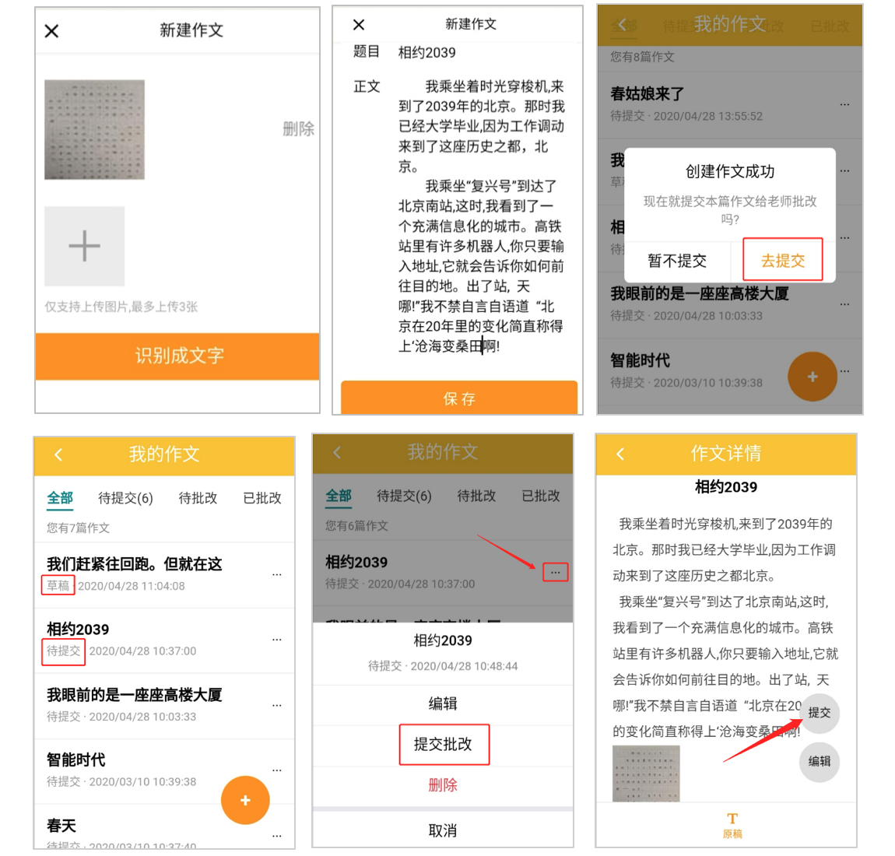

# 个人中心帮助

## 如何获取课堂讲义
1. 进入公众号[我课拼班]的[个人中心]，找到[课堂讲义]  

2. 进入[课堂讲义]列表页，最新更新的讲义在最前面。按下图提示分两步操作：  

3. 点击[复制链接]操作后，[粘贴]到电脑微信，你就能获取所选讲义的下载链接，举例如下所示：
 ```
[3946]测试3 https://cris.mecourse.cn/files/2020021309175919.pdf
[3946]测试8 https://cris.mecourse.cn/files/2020021309175919.pdf
[3946]测试4 https://cris.mecourse.cn/files/2020021309175919.pdf
```
4. 直接点击其中任一讲义的下载链接，即可完成此份讲义的查看和下载。

## 学生如何上传作文
1. 步骤一：在【我的作文】栏里上传作文  
    - 进入公众号【个人中心】，点击【我的作文】，点击【添加作文】(见下图)。  
    
    - 点击 【+】按钮，上传学生手写的作文图片(家长拍照)，最多可上传 3 张图 片，**请按照作文的书写顺序上传图片，照片需要竖拍，单页拍照，并确保 作文的完整性!!!**(见下图)。  
    
    - 图片上传好后，点击【识别成文字】按钮，此操作会将图片里的文字自动识别出 来，形成文字版作文(见下图)。  
    
    - 文字版作文识别出来后，**请家长对作文的标题和内容进行调整，并分好段落 (这步很重要!!!)**，调整完成后，点击【保存】按钮(见下图)。  
    
2. 步骤二：在【课堂反馈】>>>【反馈详情】栏里提交作业
    - 进入【课堂反馈】>>>【反馈详情】页面，点击【上传作业】按钮，选择【作 文】(见下图)。  
    
    - 选择需要提交的作文，选择好后点击【确定】按钮，此操作会将作文发送给老师 (见下图)。  
    
    - 可以在【反馈详情】页面，【已成功提交的作文】那一栏，判断作文是否提交成 功，若出现相关作文表示提交成功，反之则表示未提交成功(见下图)。  
    
