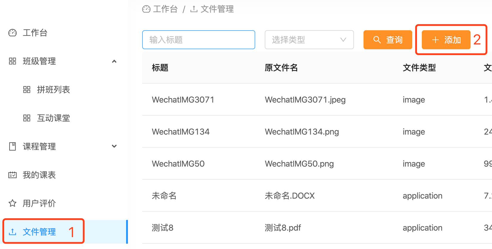

# 老师工作台FAQ

## 如何查看报名学员
在【班级管理】中，点击【拼班列表】，会显示【在拼】和【已拼】班级列表，每个班级都有一个【报名学员】显示，点击该数字，即可查看此班级学员情况（见下图）。

## 如何上传讲义
1. 登录[我课网][3]，进入老师工作台。
2. 将新的讲义上传到文件库  
在【文件管理】中，点击【添加】，根据后续提示进行操作，将讲义文件逐个上传到后台，上传的讲义可以被多个班级使用（即不同的班级可以使用相同的文件）。

上传文件支持图片、音频、视频、WORD、PDF、PPT、TXT格式。  
上传完成后，可以通过【编辑】，修改文件的标题，便于识别。
3. 将讲义添加到班级  
上传到【文件管理】中的讲义，可以添加到对应的班级里。  
操作路径如下：【班级管理】-【拼班列表】-【操作】-【添加讲义】  
选中相对应的班级，点击后面的【添加讲义】按钮  
支持添加文件库中的一个或多个文件，作为某个班级相关的讲义。  

点击【添加讲义】后，选择要添加的讲义，然后点击右下角的【绑定课次】

点击【绑定课次】后，选择此份讲义对应的课次，然后点击右下角的【保存】

保存完成后如下图，点击【关闭】即可。

## 如何管理已添加的讲义
在【班级管理】-【拼班列表】-【讲义】中，可以查看已经添加的讲义或进行移除操作。

点击【讲义】显示的数字，进入【讲义管理】界面，在此界面可以看到已经添加的课次的讲义，并可以进行【移除】操作。【2/8】表示第2次课，共8次；后面是第2次课上课时间；如果是续课的班级，这个数字会延续上一个班级的，比如3月份4次课（1-4），4月份续课会变成（5-8），5月份就是（9-12）。

## 如何批改作文
1. 登录[我课网][3]，进入老师工作台。
2. 在线查阅学生作文  
点击【学生作文】，在【班级ID】中输入班级编号，作文状态选择【待批改】，然后点击查询，当学生作文列表出现后，点击每位学生列表后面的【批改】按钮，即可进入在线批改作文界面。

3. 在线批改学生作文  
在线批改作文界面，分为三部分。
  - 最上面显示的是学生的作文原文和上传的作文照片原图，点击图片即可放大。
  - 中间部分是老师的【批改】，老师可以在【批改】的文字框里直接对学生的作文进行修改和批注。
  - 最下面一部分是【评语】，老师可以对学生的作文进行点评，直接在【评语】的文字框里输入文字即可。
  - 当老师完成全部操作后，点击右下角的【提交】按钮，即可完成这位学员的作文在线批改工作。

## 如何创建新的课程？
A：点击课程管理-新建课程，根据步骤指引，完善课程信息，然后提交课程，等待我课平台审核。通过后发布课程。

## 如何新增新的多媒体素材？
A：点击媒体管理-点击添加-上传图片、音频、视频到媒体库，等待我课平台审核，通过后可到“个人相册”-“添加”图片和视频，呈现在老师主页面中。

## 如何设置自我介绍音频？
A：录制好音频后，在“媒体管理”里点击“添加”至媒体库。然后等待我课平台审核，通过后可设置为“自我介绍音频”上传至老师主页面。
音频录制时应注意
①格式：m4a,mp3,aac；
②时长：建议30秒左右；
③音频内容清晰，无杂音等。

## 如何添加空闲时间
A：点击“个人设置”-“空闲时间”-“添加空闲时间”，该时间段会呈现至老师主页面，为用户预约时可选择的时间段。

## 如何添加授课地点
A：点击“个人设置”-“授课地点”-“添加授课地点”，该地点呈现至老师主页面，为用户预约时可选择的上课地点。

## 如何添加定价策略
A：点击“个人设置”-“定价策略”-“添加定价策略”，至少选择一个设置为默认的定价策略（收费标准）。建议根据不同的课程设置，添加不同的定价策略。便于在创建新课程时选择相应策略。

[3]:https://www.meke.ai/