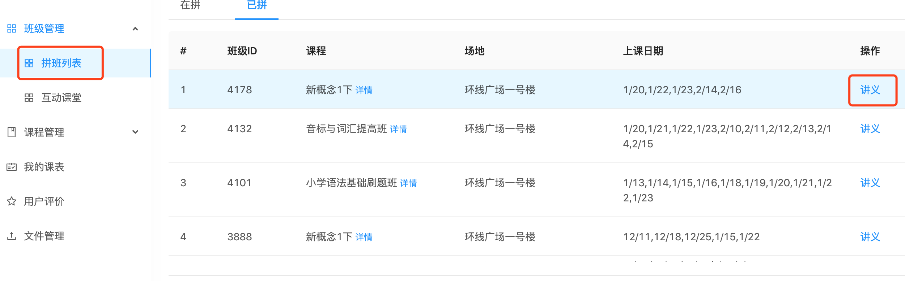
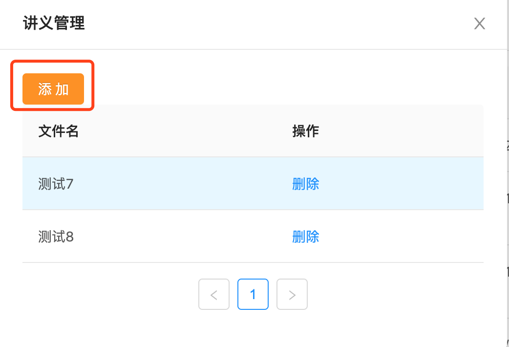
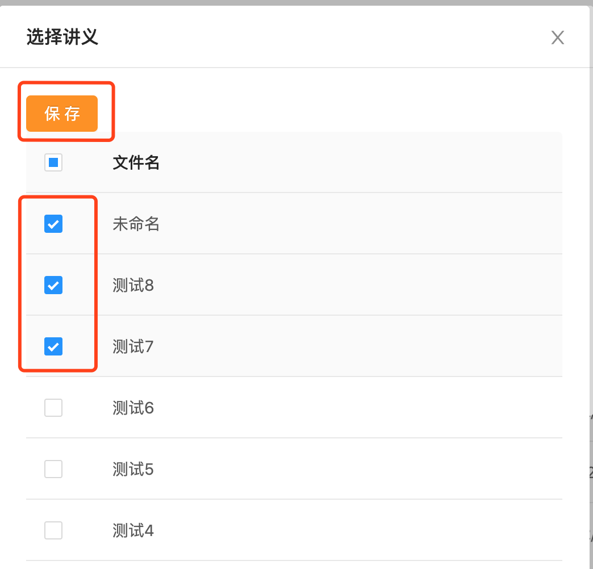

# 互动课堂帮助(老师)
目前使用的腾讯云在线教育互动课堂，具有实时音视频、交互式白板涂鸦、IM聊天室、PPT课件共享、屏幕分享等功能。

# 互动课堂客户端下载
Windows：[单击下载][1]  
macOS：暂时macOS客户端有些问题，请安装[Chrome浏览器][2]

# 如何进入互动课堂
1. 获取课堂编号  
具体请查看[如何查看课堂编号](#如何查看课堂编号)

2. 使用APP进入课堂（推荐）  
**加入课堂时需要输入【机构编号】、【课堂编号】、【帐号】、【密码】四个要素**
- 机构编号：116552
- 课堂编号：每节课都有一个唯一的课堂编号
- 账号：每位老师一个自己的账号，即老师编号
- 密码：账号对应的密码  

3. 使用Chrome浏览器进入课堂  
在浏览器地址栏中输入地址 https://tedu.qcloudtrtc.com/#/login/116552  
请注意，地址内容必须包含**https**，网页打开后地址栏前面有一把锁。

# 如何查看课堂编号
1. 登录[我课网][3]，进入老师工作台。
2. 在【我的课表】中查看课堂编号；你也可以在【班级管理/互动课堂】查看。
2. 使用[我课老师]微信小程序，登录后在【我的课表】中查看课堂编号。

# 如何创建测试课堂并提前上传课件
1. 登录[我课网][3]，进入老师工作台。
2. 在【班级管理】中，找到【互动课堂】，点击【新建课堂】，设置课堂名称及开始时间（默认开始时间为当前时间），即可创建一个测试用的互动课堂，时长为30分钟。（最新创建的课堂编号在列表中显示，列表包含所有正式课堂和测试课堂）
3. 老师通过新建的测试课堂编号，登录腾讯云互动课堂，即可在测试直播间里进行课件上传等操作。（请注意：课件上传到私人课件，不要上传到公共课件。）

# 如何上传学生讲义
1. 登录[我课网][3]，进入老师工作台。
2. 将新的讲义上传到文件库  
在【文件管理】中，点击【添加】，根据后续提示进行操作，将讲义文件逐个上传到后台，上传的讲义可以被多个班级使用（即不同的班级可以使用相同的文件）。

上传文件支持图片、音频、视频、WORD、PDF、PPT、TXT格式。  
上传完成后，可以通过【编辑】，修改文件的标题，便于识别。
3. 将讲义添加到班级  
上传到【文件管理】中的讲义，可以添加到对应的班级里。  
操作路径如下：【班级管理】-【操作】-【讲义】  
选中相对应的班级，点击后面的【讲义】按钮  
支持添加文件库中的一个或多个文件，作为某个班级相关的讲义。

点击【添加】

选择要添加的讲义，然后点击【保存】

保存完成后可继续添加其他讲义，也可【删除】，操作完成后关闭即可。家长会收到通知，并自行下载并打印讲义。

[1]:http://dldir1.qq.com/hudongzhibo/Saas/TClass_Setup_Saas.exe
[2]:https://www.google.cn/intl/zh-CN/chrome/
[3]:https://www.meke.ai/