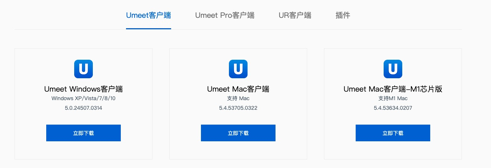
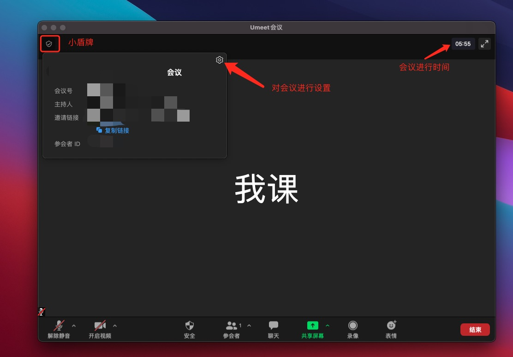

## 下载和安装
请访问[Umeet下载中心][1]，下载对应您操作系统的最新版本Umeet客户端。  
下载地址：https://www.umeet.com.cn/download

下载安装成功后，在您的应用程序中会增加一个 Umeet 应用，图标：

## 如何进入会议室上课
微信扫码登录[我课网][2]，在老师工作台下， 点击【我的课表】 ，找到对应的班级，点击【开始上课】 ，就可以直接进入会议室准备上课了。 会议入口在课程开始前 30 分钟开放，课程结束 30 分钟后关闭。

### 验证手机号码
第一次进入 zoom 时，需要验证手机号码， 这是一个中国实名制的合规要求。只要 traffic有走中国的服务器（*.zoom.com.cn）都会触发这个验证。一个设备只需要验证一次，验证通过后就无需再次验证了。？？

请注意：
等候室：老师可以手动开启了等候室功能，此时学生进入会议室，需要得到老师的允许方可进入，如有学生加入会议，老师会收到系统提示，请及时查看等候室，准许学生进入。？？

## Umeet使用教程
我们为您准备了一个视频教程供你参考：[点击查看ZOOM视频教程]( https://images.mecourse.cn/zoom/demo0707-720p.mp4 ':include :type=video controls width=100% height=400px' ) 
您也可以参考下方的文字和图片教程，帮助您快速掌握Umeet的基本功能使用。

### 显示会议进行时间
老师进入会议室后，点击屏幕左上角的小盾牌，可以进行设置，点击【常规】，勾选【显示我的会议持续时间】，然后关闭设置界面，屏幕右上方会显示会议持续时间。

### 开始上课
在老师共享屏幕之前，菜单显示栏在屏幕的下方，当老师共享屏幕后，菜单显示栏会移到屏幕的上方。 常用菜单功能如下：

A-静音：通过点击静音按钮，老师可以打开或关闭自己的麦克风。

B-视频：通过点击视频按钮，老师可以打开或关闭自己的摄像头。

C-参会者：点击参会者，可以查看进到会议室的学员名单。 老师可以在参会者这里修改自己的名字。

D-聊天：点击聊天，可以打开 Umeet 聊天功能，可以群聊（发送给所有人），也可以私聊（发送给参会者中一个人）。

E-共享屏幕：老师可以事先打开电脑里的课件，通过共享屏幕功能，将课件共享给学生看， 可以选择一个窗口共享，也可以整个电脑屏幕共享，也可以打开白板。

F-录制：有两种录制模式，一是本地录制，录制视频会保存在老师自己的电脑端；二是云录制，我课可以通过后台获取录制视频。

G-结束：点击结束后，会出现 2 个选项，一是结束会议，即注销会议室，结束后无法再进入；二是离开会议，即暂时性离开，离开后还可以再进入。

### 共享屏幕
点击共享屏幕后，会出现下图，可以选择白板，可以选择其中一个在电脑上已经打开的文件，选中为蓝色，也可以选择屏幕（请注意：屏幕是共享整个电脑屏幕）

### 注释功能
老师开启共享屏幕后，在屏幕上方的菜单栏里，会有注释功能，可以通过注释在课件上进行图画、写字等。

### 屏幕共享状态下如何开启聊天功能
点击屏幕上方菜单栏【更多】-【聊天】，可以打开聊天窗口，聊天窗口可以随意拖动。

### 结束会议
课程结束，老师退出屏幕共享，点击屏幕右下方的【结束】按钮， 选择【结束会议】即可结束会议并离开。 老师（会议主持人） 点击结束后，所有人都会退出此会议室。

[1]:https://www.umeet.com.cn/download
[2]:https://www.meke.ai/