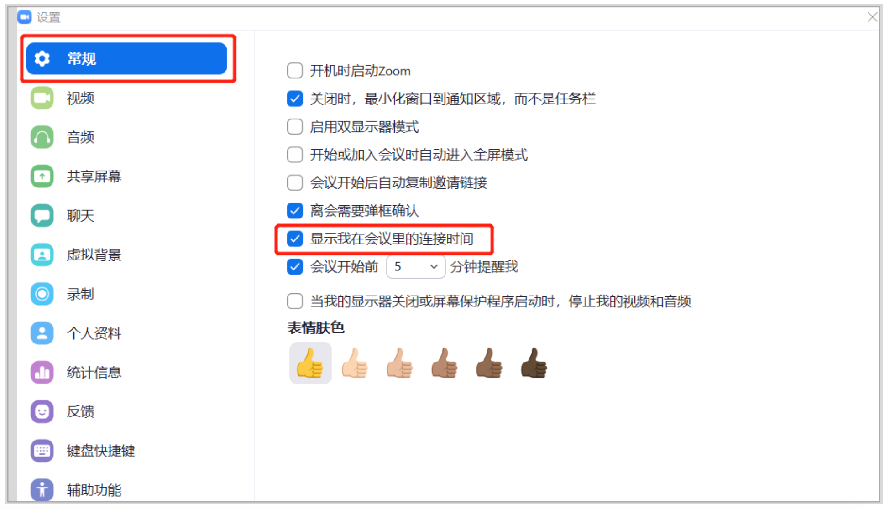

## 下载和安装客户端
当您开始或加入自己的第一个Zoom会议时，网页浏览器客户端将自动下载，还可在这里进行手动下载。

<!-- ### Windows/Mac
请访问[Zoom官网][1]，下载最新版本的Zoom会议客户端。
 
你也可以直接点击下方的链接，直接下载：  
[Windows 64位客户端][2]  
[Windows 32位客户端][3]  
[Windows Arm客户端][4]  
[针对搭载Intel芯片的Mac设备][5]  
[针对搭载Apple Silicon芯片的Mac设备][6]  
[安卓版本客户端][7]   -->

下载安装成功后，在您的应用程序中会增加一个 Zoom 应用。

## 如何进入会议室上课
微信扫码登录[我课网][8]，在老师工作台下， 点击【我的课表】 ，找到对应的班级，点击【开始上课】 ，就可以直接进入会议室准备上课了。 会议入口在课程开始前 30 分钟开放，课程结束 30 分钟后关闭。

### 验证手机号码
第一次进入 Zoom 时，需要验证手机号码， 这是一个中国实名制的合规要求。只要 traffic有走中国的服务器（*.zoom.com.cn）都会触发这个验证。一个设备只需要验证一次，验证通过后就无需再次验证了。

请注意：
等候室：老师可以手动开启了等候室功能，此时学生进入会议室，需要得到老师的允许方可进入，如有学生加入会议，老师会收到系统提示，请及时查看等候室，准许学生进入。

## Zoom使用教程
我们为您准备了一个视频教程供你参考：[点击查看ZOOM视频教程]( https://images.mecourse.cn/zoom/demo0719-720p.mp4 ':include :type=video controls width=100% height=400px' )  
您也可以参考下方的文字和图片教程，帮助您快速掌握ZOOM的基本功能使用。

### 显示会议进行时间
老师进入会议室后，点击屏幕左上角的绿色小盾牌，可以进行设置，点击【常规】，勾选【显示我在会议里的连接时间】，然后关闭设置界面，屏幕右上方会显示会议进行时间。

### 开始上课
在老师共享屏幕之前，菜单显示栏在屏幕的下方，当老师共享屏幕后，菜单显示栏会移到屏幕的上方。 常用菜单功能如下：

A-静音： 通过点击静音按钮，老师可以打开或关闭自己的麦克风。

B- 视频： 通过点击视频按钮，老师可以打开或关闭自己的摄像头。

C-参会者： 点击参会者，可以查看进到会议室的学员名单。 老师可以在参会者这里修改自己的名字。

D-聊天： 点击聊天， 可以打开 zoom 聊天功能，可以群聊（发送给所有人），也可以私聊（发送给参会者中一个人）。

E- 共享屏幕： 老师可以事先打开电脑里的课件，通过共享屏幕功能，将课件共享给学生看， 可以选择一个窗口共享，也可以整个电脑屏幕共享，也可以打开白板。

F- 录制： 有两种录制模式，一是本地录制，录制视频会保存在老师自己的电脑端； 二是云录制，我课可以通过后台获取录制视频。

G-结束： 点击结束后，会出现 2 个选项，一是结束会议，即注销会议室，结束后无法再进入；二是离开会议，即暂时性离开，离开后还可以再进入。

### 共享屏幕
点击共享屏幕后， 会出现下图，可以选择白板，可以选择其中一个在电脑上已经打开的文件， 选中为蓝色， 也可以选择屏幕（请注意： 屏幕是共享整个电脑屏幕）

### 注释功能
老师开启共享屏幕后， 在屏幕上方的菜单栏里， 会有注释功能，可以通过注释在课件上进行图画、写字等。

### 屏幕共享状态下如何开启聊天功能
点击屏幕上方菜单栏【更多】 -【聊天】 ， 可以打开聊天窗口， 聊天窗口可以随意拖动。

### 结束会议
课程结束，老师退出屏幕共享，点击屏幕右下方的【结束】按钮， 选择【结束会议】 即可结束会议并离开。 老师（会议主持人） 点击结束后， 任何人无法再重新进入此会议室。

[1]:https://zoom.us/download
[2]:https://zoom.us/client/5.15.2.18096/ZoomInstallerFull.exe?archType=x64
[3]:https://zoom.us/client/5.15.2.18096/ZoomInstallerFull.exe
[4]:https://zoom.us/client/5.15.2.18096/ZoomInstallerFull.exe?archType=winarm64
[5]:https://www.zoom.us/client/5.15.2.19786/zoomusInstallerFull.pkg
[6]:https://www.zoom.us/client/5.15.2.19786/zoomusInstallerFull.pkg?archType=arm64
[7]:https://zoom.us/client/latest/zoom.apk
[8]:https://www.meke.ai/
